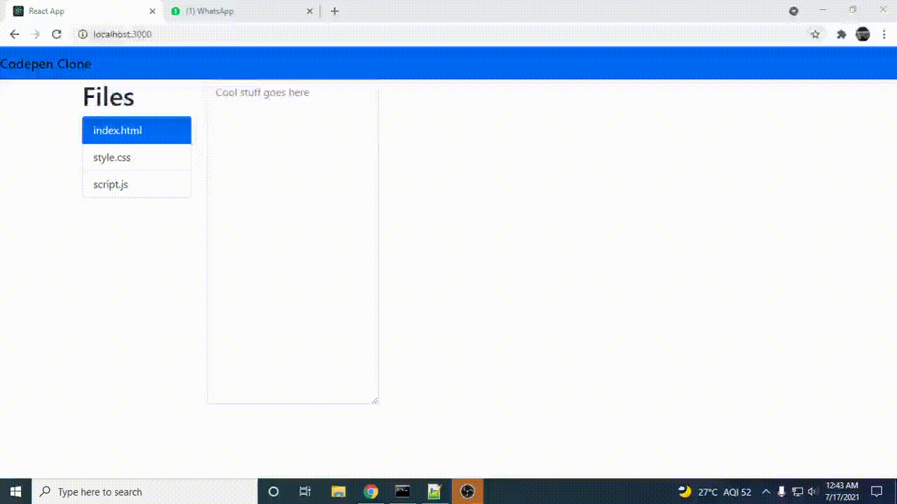

# Codepen Clone using ReactJS 
##Have a look at it!

## This is where Source Code goes
In App.js We created a class named Components

    ReactDOM.render(<Componets />, document.getElementById('root'));
  This will render our class which contains all our elements

    <textarea class="form-control" 
    onChange={this.htmlChange} 
    rows="20" 
    placeholder="Cool stuff goes here">
    </textarea>
You can see There is a method onChange which is bound to htmlChange which is bound to a state change

    htmlChange = (event) => {
    this.setState({html: event.target.value});
    }
Which changes the state of html. Similarly is done for css and js.
## Rendering HTML

    componentDidMount() {
	  this.interval = setInterval(() => this.setState({ framesrc:"<html>"+""+this.state.html+"</html>" }), 350);}
ComponentDidMount will execute on every change state and combine our code from 3 text areas to one state framesrc.
   We will use an iframe element to render html source
   

    <iframe width="100%" height="100%" srcDoc={this.state.framesrc}></iframe>
   srcDoc has a state of framesrc and hence it will automatically change.
